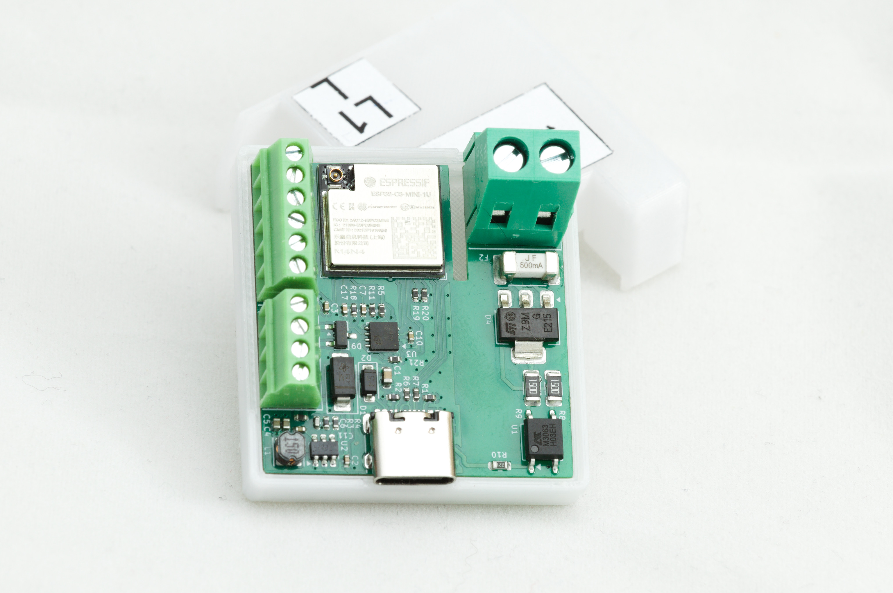

# ESPCAN 1SSR

The **ESPCAN 1SSR** is a universal, in-wall (flush-mount) smart controller equipped with a Solid State Relay (SSR). It utilizes the **CAN bus** physical layer and the **CANopen** protocol for reliable, real-time communication.

## Features

* **Core:** Powered by the ESP8685 (ESP32-C3) SoC.
* **High-Voltage Output:** 1x 230VAC SSR output, rated up to 100W.
* **Safety:** Integrated 500mA fast-blow fuse and onboard triac temperature monitoring.
* **Flexible I/O:** 4 digital inputs/outputs for connecting physical buttons, switches, or sensors.
* **Protocol:** Native CANopen support via ESPHome.
* **Form Factor:** Compact design fits standard electrical flush-mount boxes.
* **Power Supply:** Supports 5V - 24V DC input.

## Technical Specifications

| Feature | Specification |
| :--- | :--- |
| **MCU** | ESP32-C3 (ESP8685) |
| **Relay Type** | Solid State Relay (SSR) |
| **Max Load** | 100W @ 230VAC |
| **Protection** | 500mA integrated fuse |
| **Inputs/Outputs** | 4x Digital (Configurable) |
| **Communication** | CAN Bus (TX: GPIO7, RX: GPIO6) |
| **Baud Rate** | 125kbps (Default) |
| **Termination** | None (External 120Ω resistor required if needed) |
| **Thermal Protection** | Built-in NTC for Triac temperature monitoring |

## Software Integration

This device is designed to work with **ESPHome**. It uses a custom CANopen component to map internal sensors and switches directly to TPDOs (Transmit Process Data Objects).

### CANopen Mapping
The default configuration maps entities as follows:
- **TPDO 0:** Inputs IN1, IN2, IN3, IN4
- **TPDO 1:** Relay state and SSR Temperature data

Oto Punkt 2: Technical Manual & Pinout Guide przygotowany w formacie RAW Markdown, gotowy do skopiowania do pliku tekstowego:

Markdown
# Technical Manual: ESPCAN 1SSR

This manual contains the hardware pinout and software mapping for the ESPCAN 1SSR flush-mount controller.

## 1. Hardware Pinout

### CAN Bus Interface
Used for CANopen communication. Note that the device does not have an internal 120Ω resistor.

| Function | ESP32-C3 Pin | Notes |
| :--- | :--- | :--- |
| **CAN TX** | GPIO7 | Connected to CAN Transceiver |
| **CAN RX** | GPIO6 | Connected to CAN Transceiver |
| **Termination** | N/A | Attach external 120Ω resistor if at end of bus |

### Digital Inputs (IN1 - IN4)
Optimized for physical switches or dry-contact sensors.

| Name | ESP32-C3 Pin | Mode | Internal ID |
| :--- | :--- | :--- | :--- |
| **IN1** | GPIO5 | Input (Pull-down) | `in1` |
| **IN2** | GPIO4 | Input (Pull-down) | `in2` |
| **IN3** | GPIO1 | Input (Pull-down) | `in3` |
| **IN4** | GPIO0 | Input (Pull-down) | `in4` |

### Output & Thermal Monitoring
The SSR output is protected by a 500mA fuse and monitored by an onboard NTC thermistor.

| Component | ESP32-C3 Pin | Function | Specifications |
| :--- | :--- | :--- | :--- |
| **SSR Output** | GPIO2 | Load Switching | 230VAC, Max 100W |
| **NTC Sensor** | GPIO3 | Temperature Monitor | 10kΩ, B=3380 |

---

## 2. CANopen Object Dictionary
Data is organized into Transmit Process Data Objects (TPDO) for real-time reporting.

### TPDO 0: Binary Sensor States
| Index | Description | Entity ID |
| :--- | :--- | :--- |
| **1** | IN1 Status | `in1` |
| **2** | IN2 Status | `in2` |
| **3** | IN3 Status | `in3` |
| **4** | IN4 Status | `in4` |

### TPDO 1: Actuator & Analytics
| Index | Description | Entity ID |
| :--- | :--- | :--- |
| **5** | Relay State | `relay_1` |
| **6** | SSR Temperature | `ssr_temperature` |

---

## 3. Power Requirements
* **Input Voltage:** 5V - 24V DC.
* **AC Switching:** 230VAC only (Solid State Relay).
* **Fuse:** 500mA fast-blow (must be replaced with same rating if blown).

> **Warning:** High voltage is present on the SSR terminals. Installation should be performed by a qualified professional.

## License

This project is licensed under the **Creative Commons Attribution-NonCommercial-NoDerivs 4.0 International** license.

Under this license, you are free to share, copy, and redistribute the material in any medium or format, provided you follow these terms:
* **Attribution:** You must give appropriate credit.
* **Non-Commercial:** You may not use the material for commercial purposes.
* **NoDerivatives:** If you remix, transform, or build upon the material, you may not distribute the modified material.

For full details, please refer to the license links below:
* [English Version (CC BY-NC-ND 4.0)](https://creativecommons.org/licenses/by-nc-nd/4.0/deed.en)
* [Wersja Polska (CC BY-NC-ND 4.0)](https://creativecommons.org/licenses/by-nc-nd/4.0/deed.pl)

---
*Created by Wojciech Macek <wojciech.macek@gmail.com>*
